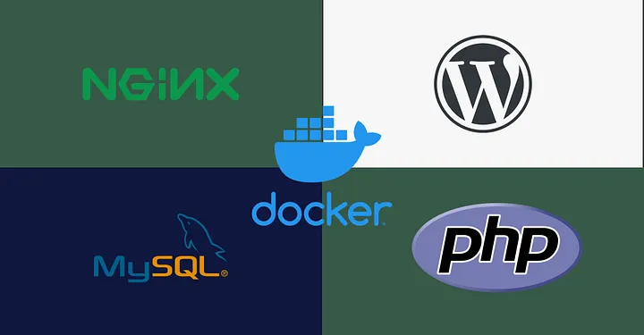

📦 Projet Inception — 42 School

📖 Description
Inception est un projet du cursus de 42 School dont l'objectif principal est d'introduire les concepts de virtualisation, de conteneurisation et d'orchestration de services à l'aide de Docker et Docker Compose.

Le projet consiste à mettre en place une infrastructure complète composée de plusieurs services fonctionnant dans des conteneurs Docker isolés mais capables de communiquer entre eux grâce à un réseau Docker.  
Chaque service est construit à partir d'une image Docker créée manuellement (via un Dockerfile) et est ensuite orchestré avec Docker Compose.

L'objectif est donc de comprendre comment déployer une application web complète en utilisant une architecture basée sur des conteneurs.

────────────────────────

🧱 Architecture du projet

L'infrastructure est composée de plusieurs services principaux :

1. NGINX  
Serveur web utilisé comme point d'entrée de l'application.  
Il est configuré pour fonctionner avec TLS afin de fournir une connexion sécurisée en HTTPS.

2. WordPress  
CMS (Content Management System) utilisé pour créer et gérer le site web.  
Il fonctionne avec PHP-FPM et communique avec la base de données.

3. MariaDB  
Système de gestion de base de données utilisé par WordPress pour stocker les données du site (articles, utilisateurs, paramètres, etc.).

Services optionnels (bonus possibles) :

• Redis → système de cache pour améliorer les performances de WordPress  
• Serveur FTP → pour transférer des fichiers vers le serveur  
• Adminer ou phpMyAdmin → interface web pour gérer la base de données  
• Portainer → interface graphique pour gérer les conteneurs Docker  
• Site statique supplémentaire

────────────────────────

🐳 Technologies utilisées

Le projet repose sur plusieurs technologies importantes :

• Docker → pour créer et exécuter les conteneurs  
• Docker Compose → pour orchestrer et connecter les services  
• NGINX → serveur web  
• WordPress → CMS pour le site web  
• MariaDB → base de données  
• Debian → image Linux utilisée comme base pour les conteneurs

────────────────────────

📁 Structure du projet

.
├── Makefile
├── secrets
├── srcs
│   ├── docker-compose.yml
│   ├── requirements
│   │   ├── mariadb
│   │   │   ├── Dockerfile
│   │   │   └── tools
│   │   ├── nginx
│   │   │   ├── Dockerfile
│   │   │   └── conf
│   │   └── wordpress
│   │       ├── Dockerfile
│   │       └── tools
│   └── .env

Explication :

Makefile  
Permet de lancer facilement les commandes pour construire et démarrer les conteneurs.

srcs/docker-compose.yml  
Fichier principal qui décrit tous les services, leurs réseaux, leurs volumes et leurs dépendances.

requirements/  
Contient la configuration spécifique de chaque service (Dockerfile, scripts, configuration).

.env  
Contient les variables d’environnement utilisées par les conteneurs.

secrets  
Stocke les informations sensibles (mots de passe, clés, etc.).

────────────────────────

⚙️ Installation et utilisation

1️⃣ Cloner le repository

git clone https://github.com/macoulib/inception.git  
cd inception

2️⃣ Configurer les variables d'environnement

Modifier le fichier .env :

DOMAIN_NAME=login.42.fr  
MYSQL_DATABASE=wordpress  
MYSQL_USER=user  
MYSQL_PASSWORD=password  
MYSQL_ROOT_PASSWORD=rootpassword

3️⃣ Lancer les services

Avec le Makefile :

make

Ou directement avec Docker Compose :

docker compose -f srcs/docker-compose.yml up --build

4️⃣ Accéder au site

Ouvrir un navigateur et aller à l'adresse :

https://macoulib.42.fr

────────────────────────

🔐 Sécurité

Le projet inclut plusieurs mesures de sécurité importantes :

• Utilisation du protocole HTTPS avec TLS  
• Isolation de chaque service dans un conteneur Docker  
• Utilisation de variables d’environnement pour les configurations sensibles  
• Utilisation de volumes pour protéger les données importantes

────────────────────────

💾 Volumes

Les volumes Docker permettent de conserver les données même si les conteneurs sont supprimés.

Dans ce projet, ils sont utilisés pour :

• stocker les données de la base MariaDB  
• conserver les fichiers WordPress

Cela garantit que les données ne sont pas perdues lors d'un redémarrage ou d'une reconstruction des conteneurs.

────────────────────────

🎯 Objectifs pédagogiques du projet

Le but du projet est de comprendre :

• la conteneurisation  
• la création d’images Docker  
• la gestion des volumes Docker  
• la configuration des réseaux Docker  
• l’orchestration de services avec Docker Compose  
• la mise en place d’un serveur web sécurisé

────────────────────────

Projet réalisé dans le cadre du cursus de 42 School.